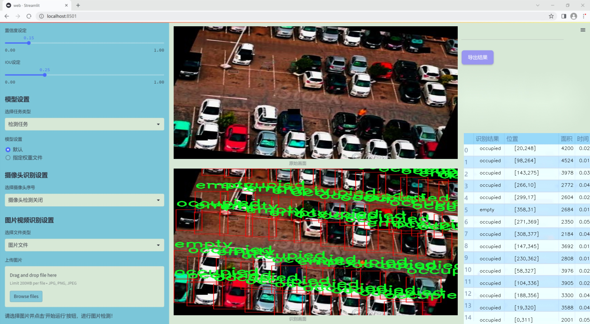
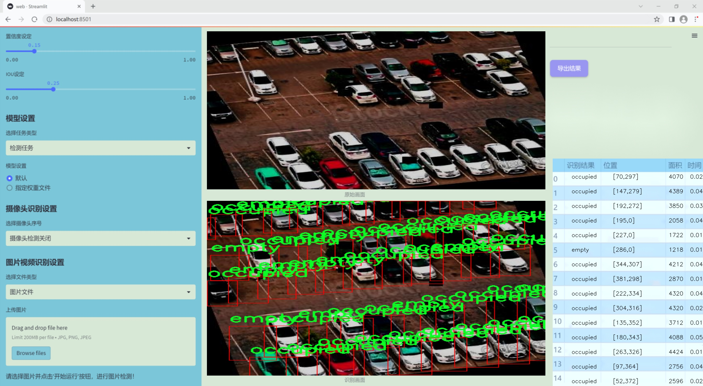
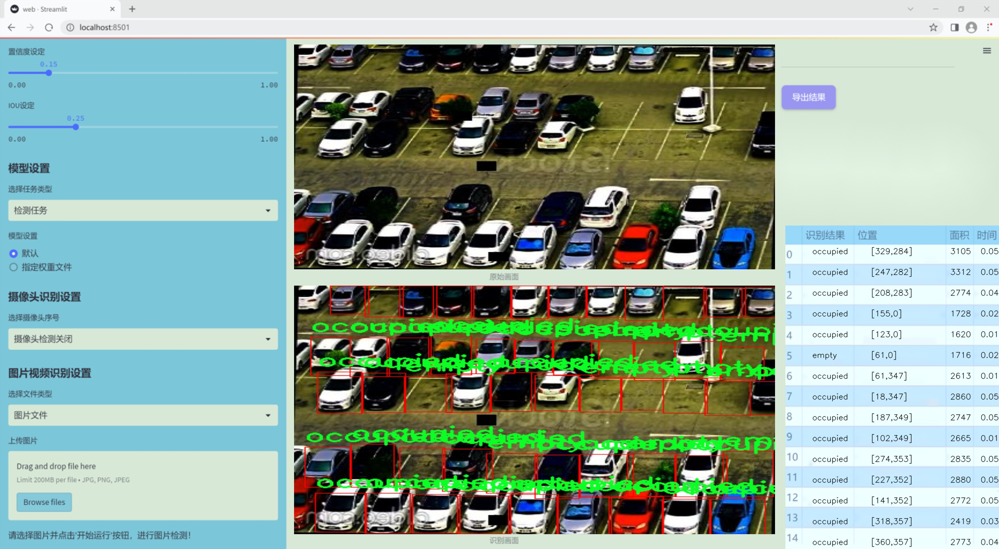
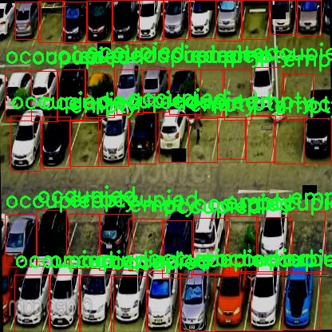
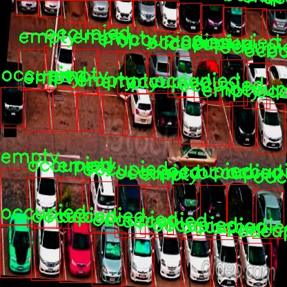
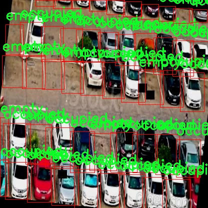
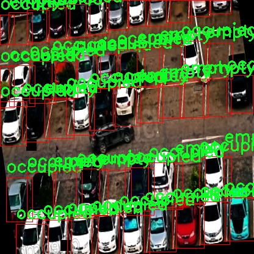
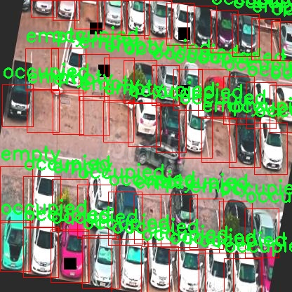

# 改进yolo11-LVMB等200+全套创新点大全：停车场车位空置状态检测系统源码＆数据集全套

### 1.图片效果展示







##### 项目来源 **[人工智能促进会 2024.11.01](https://kdocs.cn/l/cszuIiCKVNis)**

注意：由于项目一直在更新迭代，上面“1.图片效果展示”和“2.视频效果展示”展示的系统图片或者视频可能为老版本，新版本在老版本的基础上升级如下：（实际效果以升级的新版本为准）

  （1）适配了YOLOV11的“目标检测”模型和“实例分割”模型，通过加载相应的权重（.pt）文件即可自适应加载模型。

  （2）支持“图片识别”、“视频识别”、“摄像头实时识别”三种识别模式。

  （3）支持“图片识别”、“视频识别”、“摄像头实时识别”三种识别结果保存导出，解决手动导出（容易卡顿出现爆内存）存在的问题，识别完自动保存结果并导出到tempDir中。

  （4）支持Web前端系统中的标题、背景图等自定义修改。

  另外本项目提供训练的数据集和训练教程,暂不提供权重文件（best.pt）,需要您按照教程进行训练后实现图片演示和Web前端界面演示的效果。

### 2.视频效果展示

[2.1 视频效果展示](https://www.bilibili.com/video/BV1pUDwY1E49/)

### 3.背景

研究背景与意义

随着城市化进程的加快，机动车数量的激增导致了停车难的问题日益严重。停车场的车位管理效率直接影响到城市交通的流畅性和市民的出行体验。因此，开发高效的停车场车位空置状态检测系统具有重要的现实意义。近年来，深度学习技术的快速发展为目标检测领域带来了新的机遇，尤其是YOLO（You Only Look Once）系列模型因其高效的实时检测能力而备受关注。YOLOv11作为该系列的最新版本，具备更强的特征提取能力和更快的推理速度，为停车场车位状态的智能监测提供了良好的技术基础。

本研究旨在基于改进的YOLOv11模型，构建一个高效的停车场车位空置状态检测系统。通过对停车场内车位的实时监测，系统能够自动识别车位的空置、占用状态，进而为车主提供实时的停车信息，减少寻找车位的时间，提高停车场的利用率。此外，利用该系统，停车场管理者可以实时掌握车位使用情况，优化车位分配，提升管理效率。

在数据集方面，本研究使用了包含54张图像的停车场数据集，数据集中涵盖了“车”、“空位”和“占用”三类目标。这一数据集的构建为模型的训练和评估提供了基础，能够有效支持系统在不同场景下的适应性和准确性。通过对YOLOv11模型的改进与优化，期望在检测精度和实时性上取得显著提升，为智能停车解决方案的推广应用奠定基础。综上所述，本研究不仅具有重要的学术价值，也为实际应用提供了切实可行的技术支持。

### 4.数据集信息展示

##### 4.1 本项目数据集详细数据（类别数＆类别名）

nc: 2
names: ['empty', 'occupied']


该项目为【目标检测】数据集，请在【训练教程和Web端加载模型教程（第三步）】这一步的时候按照【目标检测】部分的教程来训练

##### 4.2 本项目数据集信息介绍

本项目数据集信息介绍

本项目所使用的数据集名为“parking lot”，旨在为改进YOLOv11的停车场车位空置状态检测系统提供必要的训练基础。该数据集专注于停车场车位的状态识别，涵盖了两种主要类别：空置（empty）和占用（occupied）。通过对这两种状态的有效区分，系统能够实时监测停车场的使用情况，从而为车主提供准确的停车信息，提升停车场的管理效率。

“parking lot”数据集的构建过程充分考虑了实际应用场景的复杂性。数据集中包含了多种不同环境下的停车场图像，涵盖了不同时间段、天气条件以及光照变化等因素。这种多样性确保了模型在实际应用中具备良好的泛化能力，能够适应不同的停车场布局和车位使用情况。此外，数据集中的图像经过精心标注，确保每个车位的状态信息准确无误，为模型的训练提供了可靠的基础。

在训练过程中，YOLOv11将利用该数据集进行特征学习，通过深度学习算法提取车位状态的关键特征。通过对“empty”和“occupied”这两类的学习，模型将能够在实时监测中迅速识别车位的状态变化，帮助用户快速找到可用车位，并优化停车场的空间利用率。

总之，“parking lot”数据集不仅为本项目提供了丰富的训练样本，还为改进YOLOv11的停车场车位空置状态检测系统奠定了坚实的基础。通过对该数据集的深入分析与应用，期望能够显著提升停车场管理的智能化水平，为用户带来更为便捷的停车体验。











### 5.全套项目环境部署视频教程（零基础手把手教学）

[5.1 所需软件PyCharm和Anaconda安装教程（第一步）](https://www.bilibili.com/video/BV1BoC1YCEKi/?spm_id_from=333.999.0.0&vd_source=bc9aec86d164b67a7004b996143742dc)


[5.2 安装Python虚拟环境创建和依赖库安装视频教程（第二步）](https://www.bilibili.com/video/BV1ZoC1YCEBw?spm_id_from=333.788.videopod.sections&vd_source=bc9aec86d164b67a7004b996143742dc)

### 6.改进YOLOv11训练教程和Web_UI前端加载模型教程（零基础手把手教学）

[6.1 改进YOLOv11训练教程和Web_UI前端加载模型教程（第三步）](https://www.bilibili.com/video/BV1BoC1YCEhR?spm_id_from=333.788.videopod.sections&vd_source=bc9aec86d164b67a7004b996143742dc)


按照上面的训练视频教程链接加载项目提供的数据集，运行train.py即可开始训练



     Epoch   gpu_mem       box       obj       cls    labels  img_size
     1/200     20.8G   0.01576   0.01955  0.007536        22      1280: 100%|██████████| 849/849 [14:42<00:00,  1.04s/it]
               Class     Images     Labels          P          R     mAP@.5 mAP@.5:.95: 100%|██████████| 213/213 [01:14<00:00,  2.87it/s]
                 all       3395      17314      0.994      0.957      0.0957      0.0843

     Epoch   gpu_mem       box       obj       cls    labels  img_size
     2/200     20.8G   0.01578   0.01923  0.007006        22      1280: 100%|██████████| 849/849 [14:44<00:00,  1.04s/it]
               Class     Images     Labels          P          R     mAP@.5 mAP@.5:.95: 100%|██████████| 213/213 [01:12<00:00,  2.95it/s]
                 all       3395      17314      0.996      0.956      0.0957      0.0845

     Epoch   gpu_mem       box       obj       cls    labels  img_size
     3/200     20.8G   0.01561    0.0191  0.006895        27      1280: 100%|██████████| 849/849 [10:56<00:00,  1.29it/s]
               Class     Images     Labels          P          R     mAP@.5 mAP@.5:.95: 100%|███████   | 187/213 [00:52<00:00,  4.04it/s]
                 all       3395      17314      0.996      0.957      0.0957      0.0845


###### [项目数据集下载链接](https://kdocs.cn/l/cszuIiCKVNis)

### 7.原始YOLOv11算法讲解


###### YOLOv11改进方向

与YOLOv 10相比，YOLOv 11有了巨大的改进，包括但不限于：

  * 增强的模型结构：模型具有改进的模型结构，以获取图像处理并形成预测
  * GPU优化：这是现代ML模型的反映，GPU训练ML模型在速度和准确性上都更好。
  * 速度：YOLOv 11模型现在经过增强和GPU优化以用于训练。通过优化，这些模型比它们的前版本快得多。在速度上达到了25%的延迟减少！
  * 更少的参数：更少的参数允许更快的模型，但v11的准确性不受影响
  * 更具适应性：更多支持的任务YOLOv 11支持多种类型的任务、多种类型的对象和多种类型的图像。

###### YOLOv11功能介绍

Glenn Jocher和他的团队制作了一个令人敬畏的YOLOv 11迭代，并且在图像人工智能的各个方面都提供了YOLO。YOLOv 11有多种型号，包括：

  * 对象检测-在训练时检测图像中的对象
  * 图像分割-超越对象检测，分割出图像中的对象
  * 姿态检测-当用点和线训练时绘制一个人的姿势
  * 定向检测（OBB）：类似于对象检测，但包围盒可以旋转
  * 图像分类-在训练时对图像进行分类

使用Ultralytics Library，这些模型还可以进行优化，以：

  * 跟踪-可以跟踪对象的路径
  * 易于导出-库可以以不同的格式和目的导出
  * 多场景-您可以针对不同的对象和图像训练模型

此外，Ultralytics还推出了YOLOv 11的企业模型，该模型将于10月31日发布。这将与开源的YOLOv
11模型并行，但将拥有更大的专有Ultralytics数据集。YOLOv 11是“建立在过去的成功”的其他版本的之上。

###### YOLOv11模型介绍

YOLOv 11附带了边界框模型（无后缀），实例分割（-seg），姿态估计（-pose），定向边界框（-obb）和分类（-cls）。

这些也有不同的尺寸：纳米（n），小（s），中（m），大（l），超大（x）。


YOLOv11模型

###### YOLOv11与前版本对比

与YOLOv10和YOLOv8相比，YOLOv11在Ultralytics的任何帖子中都没有直接提到。所以我会收集所有的数据来比较它们。感谢Ultralytics：

**检测：**


YOLOv11检测统计


YOLOv10检测统计

其中，Nano的mAPval在v11上为39.5，v10上为38.5；Small为47.0 vs 46.3，Medium为51.5 vs
51.1，Large为53.4 vs 53.2，Extra Large为54.7vs
54.4。现在，这可能看起来像是一种增量增加，但小小数的增加可能会对ML模型产生很大影响。总体而言，YOLOv11以0.3
mAPval的优势追平或击败YOLOv10。

现在，我们必须看看速度。在延迟方面，Nano在v11上为1.55 , v10上为1.84，Small为2.46 v2.49，Medium为4.70
v4.74，Large为6.16 v7.28，Extra Large为11.31
v10.70。延迟越低越好。YOLOv11提供了一个非常低的延迟相比，除了特大做得相当差的前身。

总的来说，Nano模型是令人振奋的，速度更快，性能相当。Extra Large在性能上有很好的提升，但它的延迟非常糟糕。

**分割：**


YOLOV11 分割统计


YOLOV9 分割统计


YOLOV8 分割数据

总体而言，YOLOv 11上的分割模型在大型和超大型模型方面比上一代YOLOv 8和YOLOv 9做得更好。

YOLOv 9 Segmentation没有提供任何关于延迟的统计数据。比较YOLOv 11延迟和YOLOv 8延迟，发现YOLOv 11比YOLOv
8快得多。YOLOv 11将大量GPU集成到他们的模型中，因此期望他们的模型甚至比CPU测试的基准更快！

姿态估计：


YOLOV11姿态估计统计


YOLOV8姿态估计统计

YOLOv 11的mAP 50 -95统计量也逐渐优于先前的YOLOv 8（除大型外）。然而，在速度方面，YOLOv
11姿势可以最大限度地减少延迟。其中一些延迟指标是版本的1/4！通过对这些模型进行GPU训练优化，我可以看到指标比显示的要好得多。

**定向边界框：**


YOLOv11 OBB统计


YOLOv8 OBB统计

OBB统计数据在mAP
50上并不是很好，只有非常小的改进，在某种程度上小于检测中的微小改进。然而，从v8到v11的速度减半，这表明YOLOv11在速度上做了很多努力。

**最后，分类：**


YOLOv 11 CLS统计


YOLOv8 CLS统计

从v8到v11，准确性也有了微小的提高。然而，速度大幅上升，CPU速度更快的型号。


### 8.200+种全套改进YOLOV11创新点原理讲解

#### 8.1 200+种全套改进YOLOV11创新点原理讲解大全

由于篇幅限制，每个创新点的具体原理讲解就不全部展开，具体见下列网址中的改进模块对应项目的技术原理博客网址【Blog】（创新点均为模块化搭建，原理适配YOLOv5~YOLOv11等各种版本）

[改进模块技术原理博客【Blog】网址链接](https://gitee.com/qunmasj/good)


#### 8.2 精选部分改进YOLOV11创新点原理讲解

###### 这里节选部分改进创新点展开原理讲解(完整的改进原理见上图和[改进模块技术原理博客链接](https://gitee.com/qunmasj/good)【如果此小节的图加载失败可以通过CSDN或者Github搜索该博客的标题访问原始博客，原始博客图片显示正常】
### 全维动态卷积ODConv
鉴于上述讨论，我们的ODConv引入了一种多维注意机制，该机制具有并行策略，用于学习卷积核在核空间的所有四个维度上的不同注意。图提供了CondConv、DyConv和ODConv的示意性比较。

ODConv的公式：根据等式1中的符号，ODConv可定义为


 将注意力标量分配给整个卷积核。图2示出了将这四种类型的关注乘以n个卷积核的过程。原则上，这四种类型的关注是相互补充的，并且以位置、信道、滤波器和核的顺序将它们逐步乘以卷积核 
 ，使得卷积运算不同w.r.t.所有空间位置、所有输入信道、所有滤波器和输入x的所有核，提供捕获丰富上下文线索的性能保证。因此，ODConv可以显著增强CNN基本卷积运算的特征提取能力。此外，具有单个卷积核的ODConv可以与标准CondConv和DyConv竞争或优于它们，为最终模型引入的额外参数大大减少。提供了大量实验来验证这些优点。通过比较等式1和等式2，我们可以清楚地看到，ODConv是一种更广义的动态卷积。此外，当设置n=1且 所有分量均为1时，只关注滤波器方向 的ODConv将减少为：将基于输入特征的SE变量应用于卷积滤波器，然后进行卷积运算（注意原始SE（Hu等人，2018b）基于输出特征，并且用于重新校准输出特征本身）。这种SE变体是ODConv的特例。


图：将ODConv中的四种注意类型逐步乘以卷积核的示例。（a） 沿空间维度的逐位置乘法运算，（b）沿输入信道维度的逐信道乘法运算、（c）沿输出信道维度的按滤波器乘法运算，以及（d）沿卷积核空间的核维度的按核乘法运算。方法部分对符号进行了说明
实现：对于ODConv，一个关键问题是如何计算卷积核的四种关注度 。继CondConv和DyConv之后，我们还使用SE型注意力模块（Hu等人，2018b），但将多个头部作为来计算它们，其结构如图所示。具体而言，首先通过逐通道全局平均池（GAP）运算将输入压缩到具有长度的特征向量中。随后，存在完全连接（FC）层和四个头部分支。ReLU（Krizhevsky等人，2012）位于FC层之后。FC层将压缩特征向量映射到具有缩减比的低维空间（根据消融实验，我们在所有主要实验中设置 ，避免了高模型复杂度）。对于四个头部分支，每个分支都有一个输出大小如图。

### 引入ODConv的改进YOLO
参考这篇博客涵盖了引入ODConv的改进YOLOv11系统的内容，ODConv采用多维注意机制，在卷积核空间的四个维度上学习不同的注意。结合了CondConv和DyConv的优势，ODConv通过图示的四种注意类型逐步与卷积核相乘，以捕获丰富的上下文线索，提升特征提取能力。

#### ODConv结构与方法
ODConv的公式和图示展示了其关注力分配给卷积核的方式，其中四种类型的关注以位置、信道、滤波器和核的顺序逐步与卷积核相乘。这种结构保证了卷积运算不同于标准的Conv操作，能够捕获更多上下文信息，从而增强了CNN的特征提取能力。另外，单个卷积核的ODConv在性能上能够与CondConv和DyConv相竞争，并且引入的额外参数大幅减少。

ODConv的特殊之处在于其广义的动态卷积性质，同时在特定条件下（n=1且所有分量为1），它可以退化为一种特例，即只关注滤波器方向，这类似于基于输入特征的SE变体，但不同于原始SE，它基于输出特征。

#### ODConv的实现
关键问题在于如何计算卷积核的四种关注度。ODConv采用了SE型注意力模块，结合了多个头部来计算这些关注度。具体实现上，通过逐通道全局平均池运算和完全连接层，将输入压缩为特征向量，随后使用四个头部分支来计算四种不同类型的关注。这样的结构能在保持模型复杂度可控的情况下，提升了特征的表征能力。

ODConv的引入为YOLOv11带来了显著的性能提升，并且通过大量实验证明了其在特征提取方面的优越性。其结合了多维注意机制和卷积操作，为目标检测和分拣系统的提升带来了新的思路和性能突破。


### 9.系统功能展示

图9.1.系统支持检测结果表格显示

  图9.2.系统支持置信度和IOU阈值手动调节

  图9.3.系统支持自定义加载权重文件best.pt(需要你通过步骤5中训练获得)

  图9.4.系统支持摄像头实时识别

  图9.5.系统支持图片识别

  图9.6.系统支持视频识别

  图9.7.系统支持识别结果文件自动保存

  图9.8.系统支持Excel导出检测结果数据


### 10. YOLOv11核心改进源码讲解

#### 10.1 ui.py

以下是代码的核心部分，并添加了详细的中文注释：

```python
import sys  # 导入系统相关的模块
import subprocess  # 导入子进程模块，用于执行外部命令

def run_script(script_path):
    """
    使用当前 Python 环境运行指定的脚本。

    Args:
        script_path (str): 要运行的脚本路径

    Returns:
        None
    """
    # 获取当前 Python 解释器的路径
    python_path = sys.executable

    # 构建运行命令，使用 streamlit 运行指定的脚本
    command = f'"{python_path}" -m streamlit run "{script_path}"'

    # 执行命令
    result = subprocess.run(command, shell=True)
    
    # 检查命令执行的返回码，如果不为0则表示出错
    if result.returncode != 0:
        print("脚本运行出错。")

# 实例化并运行应用
if __name__ == "__main__":
    # 指定要运行的脚本路径
    script_path = "web.py"  # 假设 web.py 在当前目录下

    # 调用函数运行脚本
    run_script(script_path)
```

### 代码分析
1. **导入模块**：
   - `sys`：用于获取当前 Python 解释器的路径。
   - `subprocess`：用于在 Python 中执行外部命令。

2. **`run_script` 函数**：
   - 该函数接受一个脚本路径作为参数，并使用当前 Python 环境运行该脚本。
   - 首先获取当前 Python 解释器的路径。
   - 然后构建一个命令字符串，该命令使用 `streamlit` 来运行指定的脚本。
   - 使用 `subprocess.run` 执行该命令，并检查返回码以确定脚本是否成功运行。

3. **主程序**：
   - 在 `if __name__ == "__main__":` 块中，指定要运行的脚本路径（在这里假设为 `web.py`）。
   - 调用 `run_script` 函数来执行该脚本。 

### 注意事项
- 代码中假设 `web.py` 文件在当前工作目录下，实际使用时可能需要根据实际路径进行调整。
- `subprocess.run` 的 `shell=True` 参数使得命令在 shell 中执行，这在某些情况下可能带来安全隐患，需谨慎使用。

这个程序文件 `ui.py` 的主要功能是运行一个指定的 Python 脚本，具体来说是使用 Streamlit 框架来启动一个 Web 应用。代码的结构比较简单，主要由几个部分组成。

首先，程序导入了必要的模块，包括 `sys`、`os` 和 `subprocess`。其中，`sys` 模块用于访问与 Python 解释器相关的变量和函数，`os` 模块提供了与操作系统交互的功能，而 `subprocess` 模块则用于执行外部命令。

接下来，程序定义了一个名为 `run_script` 的函数，该函数接受一个参数 `script_path`，表示要运行的脚本的路径。在函数内部，首先获取当前 Python 解释器的路径，这样可以确保在正确的环境中运行脚本。然后，构建一个命令字符串，该命令使用当前的 Python 解释器来运行指定的脚本，并通过 Streamlit 启动 Web 应用。

接着，使用 `subprocess.run` 方法执行构建好的命令。如果命令执行的返回码不为 0，表示脚本运行过程中出现了错误，程序会打印出相应的错误信息。

最后，在文件的主程序部分，首先通过 `abs_path` 函数获取名为 `web.py` 的脚本的绝对路径。然后调用 `run_script` 函数来运行这个脚本。

总体来说，这个程序的作用是简化通过 Streamlit 启动 Web 应用的过程，确保在正确的 Python 环境中运行指定的脚本。

#### 10.2 utils.py

以下是代码中最核心的部分，并附上详细的中文注释：

```python
import torch
import torch.nn.functional as F

def multi_scale_deformable_attn_pytorch(
    value: torch.Tensor,
    value_spatial_shapes: torch.Tensor,
    sampling_locations: torch.Tensor,
    attention_weights: torch.Tensor,
) -> torch.Tensor:
    """
    多尺度可变形注意力机制。

    参数:
    - value: 输入特征图，形状为 (bs, C, num_heads, embed_dims)
    - value_spatial_shapes: 特征图的空间形状，形状为 (num_levels, 2)
    - sampling_locations: 采样位置，形状为 (bs, num_queries, num_heads, num_levels, num_points, 2)
    - attention_weights: 注意力权重，形状为 (bs, num_heads, num_queries, num_levels, num_points)

    返回:
    - output: 经过多尺度可变形注意力机制处理后的输出，形状为 (bs, num_queries, num_heads * embed_dims)
    """
    bs, _, num_heads, embed_dims = value.shape  # 获取输入特征图的维度
    _, num_queries, _, num_levels, num_points, _ = sampling_locations.shape  # 获取采样位置的维度

    # 将输入特征图根据空间形状分割成多个层次
    value_list = value.split([H_ * W_ for H_, W_ in value_spatial_shapes], dim=1)
    
    # 将采样位置转换到[-1, 1]的范围
    sampling_grids = 2 * sampling_locations - 1
    sampling_value_list = []  # 用于存储每个层次的采样值

    for level, (H_, W_) in enumerate(value_spatial_shapes):
        # 将当前层次的特征图重塑为适合采样的形状
        value_l_ = value_list[level].flatten(2).transpose(1, 2).reshape(bs * num_heads, embed_dims, H_, W_)
        
        # 处理当前层次的采样位置
        sampling_grid_l_ = sampling_grids[:, :, :, level].transpose(1, 2).flatten(0, 1)
        
        # 使用双线性插值从特征图中采样
        sampling_value_l_ = F.grid_sample(
            value_l_, sampling_grid_l_, mode="bilinear", padding_mode="zeros", align_corners=False
        )
        sampling_value_list.append(sampling_value_l_)  # 将采样值添加到列表中

    # 重塑注意力权重以适应后续计算
    attention_weights = attention_weights.transpose(1, 2).reshape(
        bs * num_heads, 1, num_queries, num_levels * num_points
    )
    
    # 计算最终输出
    output = (
        (torch.stack(sampling_value_list, dim=-2).flatten(-2) * attention_weights)  # 应用注意力权重
        .sum(-1)  # 在最后一个维度上求和
        .view(bs, num_heads * embed_dims, num_queries)  # 重塑输出形状
    )
    
    return output.transpose(1, 2).contiguous()  # 返回最终输出，调整维度顺序
```

### 代码注释说明：
1. **函数定义**：`multi_scale_deformable_attn_pytorch` 是实现多尺度可变形注意力机制的核心函数。
2. **参数说明**：详细描述了输入参数的含义和形状。
3. **维度获取**：通过 `value.shape` 和 `sampling_locations.shape` 获取批量大小、头数、嵌入维度等信息。
4. **特征图分割**：使用 `split` 方法将输入特征图分割成多个层次，便于后续处理。
5. **采样位置转换**：将采样位置从[0, 1]范围转换到[-1, 1]范围，以适应 `grid_sample` 函数的要求。
6. **双线性插值采样**：使用 `F.grid_sample` 从特征图中进行采样，得到每个层次的采样值。
7. **注意力权重处理**：对注意力权重进行转置和重塑，以便与采样值进行相乘。
8. **输出计算**：通过加权求和得到最终输出，并调整输出的维度顺序以符合预期形状。

这个程序文件 `utils.py` 是一个用于实现多种实用功能的模块，主要用于深度学习中的模型构建，特别是在使用 YOLO（You Only Look Once）目标检测模型时。文件中包含了一些函数，这些函数涉及到模块的克隆、权重初始化、反 sigmoid 函数的计算以及多尺度可变形注意力机制的实现。

首先，文件导入了一些必要的库，包括 `copy`、`math`、`numpy` 和 `torch`，其中 `torch` 是 PyTorch 的核心库，提供了张量操作和深度学习所需的各种功能。

接下来，定义了一个 `_get_clones` 函数，该函数用于创建一个给定模块的克隆列表。它接受一个模块和一个整数 `n` 作为参数，返回一个包含 `n` 个克隆模块的 `ModuleList`，这在构建多层网络时非常有用。

`bias_init_with_prob` 函数用于根据给定的先验概率初始化卷积或全连接层的偏置值。它通过对数几率的计算返回一个浮点数，确保在特定的概率下，模型的输出能够达到预期的效果。

`linear_init` 函数用于初始化线性模块的权重和偏置。它根据模块权重的形状计算一个边界值，并使用均匀分布对权重和偏置进行初始化，确保模型在训练开始时有一个合理的参数设置。

`inverse_sigmoid` 函数计算给定张量的反 sigmoid 函数。它首先将输入张量限制在 0 到 1 之间，然后计算反 sigmoid 值，返回一个新的张量。这在某些情况下可以用于优化模型的训练过程。

最后，`multi_scale_deformable_attn_pytorch` 函数实现了多尺度可变形注意力机制。该函数接受多个参数，包括值张量、空间形状、采样位置和注意力权重。函数内部首先对输入的值张量进行分割，然后计算采样网格，并通过双线性插值从不同的尺度中采样值。最后，将采样值与注意力权重结合，计算出最终的输出。这个过程涉及到对张量的维度重塑和转换，以适应多头注意力机制的要求。

总体而言，这个文件提供了一些基础的工具函数和多尺度注意力机制的实现，能够为 YOLO 模型的构建和训练提供支持。

#### 10.3 mamba_yolo.py

以下是代码中最核心的部分，并附上详细的中文注释：

```python
import torch
import torch.nn as nn
from einops import rearrange

class LayerNorm2d(nn.Module):
    """自定义的二维层归一化类"""
    def __init__(self, normalized_shape, eps=1e-6, elementwise_affine=True):
        super().__init__()
        # 初始化LayerNorm，normalized_shape为归一化的形状
        self.norm = nn.LayerNorm(normalized_shape, eps, elementwise_affine)

    def forward(self, x):
        # 将输入张量从 (B, C, H, W) 变换为 (B, H, W, C)
        x = rearrange(x, 'b c h w -> b h w c').contiguous()
        # 进行层归一化
        x = self.norm(x)
        # 将张量恢复为 (B, C, H, W) 形状
        x = rearrange(x, 'b h w c -> b c h w').contiguous()
        return x

class CrossScan(torch.autograd.Function):
    """交叉扫描操作的自定义函数"""
    @staticmethod
    def forward(ctx, x: torch.Tensor):
        B, C, H, W = x.shape  # 获取输入张量的形状
        ctx.shape = (B, C, H, W)  # 保存形状以备后用
        xs = x.new_empty((B, 4, C, H * W))  # 创建新的张量用于存储结果
        xs[:, 0] = x.flatten(2, 3)  # 将输入张量展平
        xs[:, 1] = x.transpose(dim0=2, dim1=3).flatten(2, 3)  # 转置并展平
        xs[:, 2:4] = torch.flip(xs[:, 0:2], dims=[-1])  # 翻转前两个结果
        return xs

    @staticmethod
    def backward(ctx, ys: torch.Tensor):
        B, C, H, W = ctx.shape  # 获取保存的形状
        L = H * W  # 计算长度
        # 计算反向传播的梯度
        ys = ys[:, 0:2] + ys[:, 2:4].flip(dims=[-1]).view(B, 2, -1, L)
        y = ys[:, 0] + ys[:, 1].view(B, -1, W, H).transpose(dim0=2, dim1=3).contiguous().view(B, -1, L)
        return y.view(B, -1, H, W)  # 返回反向传播的结果

class SelectiveScanCore(torch.autograd.Function):
    """选择性扫描的核心自定义函数"""
    @staticmethod
    @torch.cuda.amp.custom_fwd
    def forward(ctx, u, delta, A, B, C, D=None, delta_bias=None, delta_softplus=False, nrows=1, backnrows=1, oflex=True):
        # 确保输入张量是连续的
        if u.stride(-1) != 1:
            u = u.contiguous()
        if delta.stride(-1) != 1:
            delta = delta.contiguous()
        if D is not None and D.stride(-1) != 1:
            D = D.contiguous()
        if B.stride(-1) != 1:
            B = B.contiguous()
        if C.stride(-1) != 1:
            C = C.contiguous()
        
        # 处理输入张量的维度
        if B.dim() == 3:
            B = B.unsqueeze(dim=1)
            ctx.squeeze_B = True
        if C.dim() == 3:
            C = C.unsqueeze(dim=1)
            ctx.squeeze_C = True
        
        ctx.delta_softplus = delta_softplus
        ctx.backnrows = backnrows
        
        # 调用CUDA核心函数进行前向计算
        out, x, *rest = selective_scan_cuda_core.fwd(u, delta, A, B, C, D, delta_bias, delta_softplus, 1)
        ctx.save_for_backward(u, delta, A, B, C, D, delta_bias, x)  # 保存用于反向传播的张量
        return out

    @staticmethod
    @torch.cuda.amp.custom_bwd
    def backward(ctx, dout, *args):
        u, delta, A, B, C, D, delta_bias, x = ctx.saved_tensors  # 获取保存的张量
        if dout.stride(-1) != 1:
            dout = dout.contiguous()
        # 调用CUDA核心函数进行反向计算
        du, ddelta, dA, dB, dC, dD, ddelta_bias, *rest = selective_scan_cuda_core.bwd(
            u, delta, A, B, C, D, delta_bias, dout, x, ctx.delta_softplus, 1
        )
        return (du, ddelta, dA, dB, dC, dD, ddelta_bias, None, None, None, None)  # 返回梯度

def cross_selective_scan(
        x: torch.Tensor = None,
        x_proj_weight: torch.Tensor = None,
        x_proj_bias: torch.Tensor = None,
        dt_projs_weight: torch.Tensor = None,
        dt_projs_bias: torch.Tensor = None,
        A_logs: torch.Tensor = None,
        Ds: torch.Tensor = None,
        out_norm: torch.nn.Module = None,
        out_norm_shape="v0",
        nrows=-1,
        backnrows=-1,
        delta_softplus=True,
        to_dtype=True,
        force_fp32=False,
        ssoflex=True,
        SelectiveScan=None,
        scan_mode_type='default'
):
    """交叉选择性扫描的主函数"""
    B, D, H, W = x.shape  # 获取输入张量的形状
    D, N = A_logs.shape  # 获取A_logs的形状
    K, D, R = dt_projs_weight.shape  # 获取dt_projs_weight的形状
    L = H * W  # 计算长度

    def selective_scan(u, delta, A, B, C, D=None, delta_bias=None, delta_softplus=True):
        return SelectiveScan.apply(u, delta, A, B, C, D, delta_bias, delta_softplus, nrows, backnrows, ssoflex)

    xs = CrossScan.apply(x)  # 进行交叉扫描

    # 进行投影计算
    x_dbl = torch.einsum("b k d l, k c d -> b k c l", xs, x_proj_weight)
    if x_proj_bias is not None:
        x_dbl = x_dbl + x_proj_bias.view(1, K, -1, 1)
    
    # 拆分投影结果
    dts, Bs, Cs = torch.split(x_dbl, [R, N, N], dim=2)
    dts = torch.einsum("b k r l, k d r -> b k d l", dts, dt_projs_weight)
    xs = xs.view(B, -1, L)
    dts = dts.contiguous().view(B, -1, L)

    # HiPPO矩阵
    As = -torch.exp(A_logs.to(torch.float))  # 计算A
    Bs = Bs.contiguous()
    Cs = Cs.contiguous()
    Ds = Ds.to(torch.float)  # 转换Ds为浮点型
    delta_bias = dt_projs_bias.view(-1).to(torch.float)  # 转换dt_projs_bias为浮点型

    # 如果需要强制使用fp32，则转换张量类型
    if force_fp32:
        xs = xs.to(torch.float)
        dts = dts.to(torch.float)
        Bs = Bs.to(torch.float)
        Cs = Cs.to(torch.float)

    # 进行选择性扫描
    ys: torch.Tensor = selective_scan(
        xs, dts, As, Bs, Cs, Ds, delta_bias, delta_softplus
    ).view(B, K, -1, H, W)

    # 进行交叉合并
    y: torch.Tensor = CrossMerge.apply(ys)

    # 根据输出归一化的形状进行处理
    if out_norm_shape in ["v1"]:  # (B, C, H, W)
        y = out_norm(y.view(B, -1, H, W)).permute(0, 2, 3, 1)  # (B, H, W, C)
    else:  # (B, L, C)
        y = y.transpose(dim0=1, dim1=2).contiguous()  # (B, L, C)
        y = out_norm(y).view(B, H, W, -1)

    return (y.to(x.dtype) if to_dtype else y)  # 返回结果

class SS2D(nn.Module):
    """选择性扫描2D模块"""
    def __init__(self, d_model=96, d_state=16, ssm_ratio=2.0, ssm_rank_ratio=2.0, dt_rank="auto", act_layer=nn.SiLU, dropout=0.0, bias=False, forward_type="v2", **kwargs):
        super().__init__()
        d_expand = int(ssm_ratio * d_model)  # 扩展维度
        d_inner = int(min(ssm_rank_ratio, ssm_ratio) * d_model) if ssm_rank_ratio > 0 else d_expand  # 内部维度
        self.dt_rank = math.ceil(d_model / 16) if dt_rank == "auto" else dt_rank  # dt_rank的设置
        self.d_state = math.ceil(d_model / 6) if d_state == "auto" else d_state  # d_state的设置

        # 输入投影
        d_proj = d_expand if self.disable_z else (d_expand * 2)
        self.in_proj = nn.Conv2d(d_model, d_proj, kernel_size=1, stride=1, groups=1, bias=bias, **kwargs)
        self.act: nn.Module = nn.GELU()  # 激活函数

        # 输出投影
        self.out_proj = nn.Conv2d(d_expand, d_model, kernel_size=1, stride=1, bias=bias, **kwargs)
        self.dropout = nn.Dropout(dropout) if dropout > 0. else nn.Identity()  # dropout层

    def forward_corev2(self, x: torch.Tensor, channel_first=False, SelectiveScan=SelectiveScanCore, cross_selective_scan=cross_selective_scan, force_fp32=None):
        if not channel_first:
            x = x.permute(0, 3, 1, 2).contiguous()  # 调整维度
        x = cross_selective_scan(
            x, self.x_proj_weight, None, self.dt_projs_weight, self.dt_projs_bias,
            self.A_logs, self.Ds,
            out_norm=getattr(self, "out_norm", None),
            out_norm_shape=getattr(self, "out_norm_shape", "v0"),
            delta_softplus=True, force_fp32=force_fp32,
            SelectiveScan=SelectiveScan, ssoflex=self.training,
        )
        return x

    def forward(self, x: torch.Tensor, **kwargs):
        x = self.in_proj(x)  # 输入投影
        x = self.act(x)  # 激活
        y = self.forward_core(x)  # 核心前向计算
        out = self.dropout(self.out_proj(y))  # 输出投影和dropout
        return out
```

### 主要功能
1. **LayerNorm2d**: 实现了二维层归一化，适用于图像数据。
2. **CrossScan**: 实现了交叉扫描操作，用于在特征图上进行交叉处理。
3. **SelectiveScanCore**: 实现了选择性扫描的前向和反向传播，主要用于优化序列数据的处理。
4. **SS2D**: 选择性扫描2D模块，结合了输入投影、选择性扫描和输出投影的功能。

这些核心部分构成了深度学习模型中的重要模块，尤其是在处理图像和序列数据时。

这个程序文件 `mamba_yolo.py` 是一个用于构建 YOLO（You Only Look Once）模型的 PyTorch 实现，主要包含了多种神经网络模块和功能。以下是对代码的详细说明。

首先，文件导入了必要的库，包括 PyTorch、数学库、函数工具库以及一些自定义的模块。它定义了一些基本的神经网络组件，如 `LayerNorm2d`、`CrossScan`、`CrossMerge` 和 `SelectiveScanCore`，这些组件在后续的网络结构中被广泛使用。

`LayerNorm2d` 是一个二维层归一化模块，适用于图像数据。它在前向传播中调整输入的维度，以便应用归一化操作。

`autopad` 函数用于自动计算卷积操作的填充，以确保输出的形状与输入相同。它根据给定的卷积核大小和扩张率来确定填充的大小。

`CrossScan` 和 `CrossMerge` 是自定义的自动求导函数，分别用于在输入张量上执行交叉扫描和合并操作。这些操作在处理特征图时非常有用，尤其是在需要捕捉空间信息的任务中。

`SelectiveScanCore` 是一个实现选择性扫描的核心功能的类，它利用 CUDA 加速来提高计算效率。选择性扫描是一种用于高效处理序列数据的技术，能够在时间维度上进行高效的累加操作。

`cross_selective_scan` 函数实现了选择性扫描的具体逻辑，它接收多个输入参数并返回处理后的输出。这个函数的设计考虑了多种输入形状和类型，以适应不同的应用场景。

`SS2D` 类是一个主要的模块，包含了多个层和操作，包括输入投影、卷积、选择性扫描等。它的设计允许灵活配置模型的各个参数，如模型维度、状态维度、卷积核大小等。

`RGBlock` 和 `LSBlock` 是两个基本的网络块，分别实现了不同的前向传播逻辑。`RGBlock` 结合了卷积和激活函数，而 `LSBlock` 则使用了分组卷积和批归一化，旨在提高模型的表达能力。

`XSSBlock` 和 `VSSBlock_YOLO` 是更复杂的模块，结合了多个基本块和选择性扫描的功能。它们的设计允许在 YOLO 模型中有效地处理图像特征，并实现多层次的特征融合。

`SimpleStem` 和 `VisionClueMerge` 是用于特征提取和融合的辅助模块。`SimpleStem` 通过一系列卷积层来提取输入特征，而 `VisionClueMerge` 则用于将不同来源的特征进行合并，以增强模型的表达能力。

整体来看，这个文件实现了一个复杂的深度学习模型，结合了多种先进的技术和结构，旨在提高目标检测任务的性能。通过灵活的模块设计和高效的计算实现，用户可以根据需要调整模型的各个部分，以适应不同的应用场景。

#### 10.4 TransNext.py

以下是经过简化和注释的核心代码部分：

```python
try:
    # 尝试导入swattention模块和TransNext_cuda中的内容
    import swattention
    from ultralytics.nn.backbone.TransNeXt.TransNext_cuda import *
except ImportError as e:
    # 如果导入失败（例如模块不存在），则导入TransNext_native中的内容
    from ultralytics.nn.backbone.TransNeXt.TransNext_native import *
    pass  # 继续执行，不做其他处理
```

### 代码注释说明：
1. **try-except 结构**：该结构用于处理可能出现的异常。在这里，尝试导入一些模块，如果导入失败，则执行except块中的代码。
  
2. **导入模块**：
   - `import swattention`：尝试导入名为`swattention`的模块。如果该模块存在，则可以使用其中的功能。
   - `from ultralytics.nn.backbone.TransNeXt.TransNext_cuda import *`：尝试从`TransNext_cuda`中导入所有内容。这通常是一个针对CUDA加速的实现。

3. **异常处理**：
   - `except ImportError as e`：捕获导入错误，如果在尝试导入时发生`ImportError`（例如，模块不存在），则执行以下代码。
   - `from ultralytics.nn.backbone.TransNeXt.TransNext_native import *`：在导入CUDA版本失败的情况下，导入`TransNext_native`中的所有内容。这通常是一个不依赖于CUDA的实现。

4. **pass 语句**：在except块中使用`pass`表示不执行任何操作，继续程序的执行。这意味着即使导入失败，程序也不会中断，而是会继续运行后续的代码。

这个程序文件名为 `TransNext.py`，主要功能是导入所需的模块和类。代码首先尝试导入 `swattention` 模块以及 `TransNext_cuda` 中的内容，这表明该程序可能是为了利用 CUDA 加速的版本进行计算。如果在导入过程中发生 `ImportError`（即找不到指定的模块或类），程序会捕获这个异常，并转而导入 `TransNext_native` 中的内容。这种设计通常用于兼容性处理，确保在不同的环境中都能找到可用的实现。总的来说，这段代码展示了一个灵活的模块导入机制，以便在不同的硬件或软件配置下运行。

注意：由于此博客编辑较早，上面“10.YOLOv11核心改进源码讲解”中部分代码可能会优化升级，仅供参考学习，以“11.完整训练+Web前端界面+200+种全套创新点源码、数据集获取”的内容为准。

### 11.完整训练+Web前端界面+200+种全套创新点源码、数据集获取


# [下载链接：https://mbd.pub/o/bread/Zp6ampdr](https://mbd.pub/o/bread/Zp6ampdr)